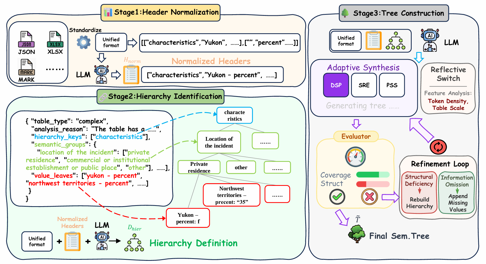
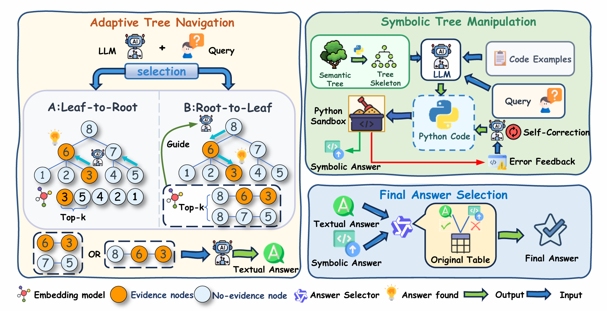

# ASTRA: Adaptive Structured Tree Reasoning Architecture for Complex Table Question Answering

[](https://arxiv.org/abs/2604.08999)
[](https://github.com/zjukg/ASTRA)


This is the official repository for the paper: **"ASTRA: Adaptive Structured Tree Reasoning Architecture for Complex Table Question Answering"**, accepted at **ACL 2026**.

ASTRA converts complex tables into hierarchical tree structures and performs question answering over the tree instead of directly over a flat 2D table. The repository includes the main pipeline, baselines, evaluation tools, and an interactive demo.

## Overview

<table>
<tr>
<td align="center" width="50%">

**Phase 1: Table-to-Tree Construction**



</td>
<td align="center" width="50%">

**Phase 2: Tree-based QA**



</td>
</tr>
</table>

Key ideas:
- Convert flat tables into structured tree representations while preserving header and row hierarchies.
- Navigate relevant tree paths before answer generation.
- Support both rule-based and LLM-based tree construction.
- Add optional symbolic reasoning for numerical questions.

## Repository Layout

```text
table2tree/
├── astra_config.py           # Shared environment, dataset, and path helpers
├── model_clients.py          # Shared OpenAI-compatible and local model clients
├── tableqa.py                # Main batch pipeline
├── table2tree.py             # Table-to-tree conversion
├── treeqa.py                 # Tree-based QA and symbolic reasoning
├── evaluate.py               # Prediction evaluation
├── llm_select.py             # Answer selector utility
├── demo/                     # FastAPI + React demo
├── baseline/                 # Direct and tree-direct baselines
├── quality_evaluate/         # Tree quality evaluation
├── Batch_evaluate/           # Multi-rollout stability evaluation
├── fig/                      # README figures
└── requirements.txt
```

The codebase is now organized around three shared layers:
- `astra_config.py`: centralizes environment loading and common paths.
- `model_clients.py`: centralizes model endpoint selection and client behavior.
- Task modules (`tableqa.py`, `treeqa.py`, `demo/`, `baseline/`): focus on pipeline logic instead of local machine configuration.

## Setup

```bash
conda create -n astra python=3.10
conda activate astra
pip install -r requirements.txt
```

Optional demo dependencies are listed in `demo/requirements.txt`.

### Environment Variables

Copy the template and fill only the keys you need:

```bash
cp .env.example .env
```

Most users only need:

```bash
OPENAI_API_KEY=your_openai_api_key_here
OPENAI_BASE_URL=https://api.openai.com/v1
```

Optional variables:
- `VOLCES_API_KEY`, `DEEPSEEK_API_KEY`, `ALIYUN_API_KEY`: provider-specific aliases already used in the codebase.
- `ASTRA_DATASET_DIR`: dataset root. If unset, the code looks for `../dataset`.
- `ASTRA_EMBEDDING_MODEL_PATH`: local embedding model path for retrieval.
- `ASTRA_LOCAL_MODEL_BASE_URL`: local generation server for open-source models.
- `ASTRA_MODEL_PATH` or `ASTRA_MODEL_PATH_<MODEL_NAME>`: local checkpoint path for `model_deploy.py`.

## Dataset Layout

By default ASTRA expects datasets under `../dataset/`:

```text
dataset/
├── hitab/
│   ├── test_samples_clean.jsonl
│   └── tables/raw/*.json
├── AIT-QA/
│   └── aitqa_clean_questions.json
├── SSTQA-zh/
│   ├── test.jsonl
│   └── table/*.xlsx
├── RealHiTBench/
│   ├── QA_final_filter.json
│   └── csv/*.csv
└── MMQA/
    └── Synthesized_three_table.json
```

If your data is elsewhere, set `ASTRA_DATASET_DIR` in `.env`.

## Main Pipeline

Run the main pipeline from the terminal:

```bash
python tableqa.py \
  --dataset hitab \
  --table2-tree-method llm_based \
  --table2-tree-mode normal \
  --model-name-table2tree gpt-4o \
  --model-name-treeqa gpt-4o \
  --model-type-treecons oai \
  --model-type-qa oai \
  --start-index 0 \
  --end-index 100 \
  --enable-quality-eval
```

Outputs are written to `record/`.

Useful optional flags:
- `--force-generate`: ignore cached tree tables and regenerate them.
- `--no-embedding`: disable embedding-assisted retrieval in `TreeQA`.
- `--disable-quality-eval`: skip tree quality evaluation for faster runs.

## Evaluation

Evaluate prediction files with:

```bash
python evaluate.py --input record/your_results.json
```

Tree quality evaluation is available through:

```python
from quality_evaluate import evaluate_tree_quality

metrics = evaluate_tree_quality(
    original_table=table,
    tree_table=generated_tree,
    handle_combined_keys=True,
)
```

Multi-rollout stability evaluation is available through:

```python
from Batch_evaluate import TreeBatchEvaluator

evaluator = TreeBatchEvaluator(output_dir="./batch_results")
```

## Baselines

Two baseline scripts are included:
- `baseline/direct.py`: direct table QA without tree conversion.
- `baseline/tree_direct.py`: tree construction followed by direct QA over the tree.

Both reuse the shared dataset loader and model configuration.

## Interactive Demo

The demo visualizes upload, tree construction, and QA reasoning.

```bash
cd demo
pip install -r requirements.txt

cd frontend
npm install
npm run build
cd ..

python server.py
```

Then open `http://localhost:8080`.

For frontend development:

```bash
cd demo/frontend
npm run dev
```

## Citation

```bibtex
@misc{guo2026astraadaptivestructuredtree,
  title={ASTRA: Adaptive Structured Tree Reasoning Architecture for Complex Table Question Answering},
  author={Xiaoke Guo and Songze Li and Zhiqiang Liu and Zhaoyan Gong and Yuanxiang Liu and Huajun Chen and Wen Zhang},
  year={2026},
  eprint={2604.08999},
  archivePrefix={arXiv},
  primaryClass={cs.CL},
  url={https://arxiv.org/abs/2604.08999}
}
```
